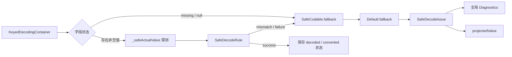
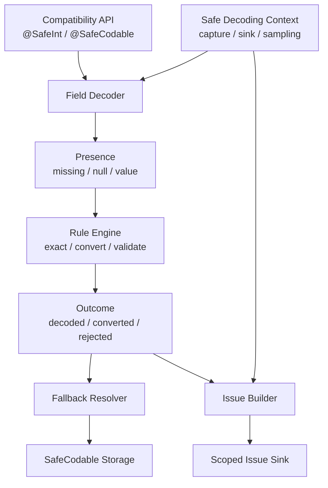

# SwiftCodable 当前架构评估与演进方案

> 评估日期：2026-07-24  
> 评估范围：`Package.swift`、`SwiftCodable.podspec`、`Sources/SwiftCodable`、
> `Tests/SwiftCodableTests`、README 和现有设计文档。  
> 验证结果：`swift test` 与
> `swift test -Xswiftc -swift-version -Xswiftc 6` 均通过，27 个 XCTest
> 无失败。

## 1. 结论

当前框架的方向是正确的，已经具备成为稳定基础库的主要元素：

- 使用属性包装器解决 synthesized `Codable` 对 missing key 不友好的问题。
- 默认值、类型转换、业务校验可以通过泛型 Policy 扩展。
- missing、null、类型错误、转换失败、溢出和校验失败已有结构化诊断。
- 常用 API 简洁，现有测试覆盖了默认值、数值转换、嵌套模型、集合、类模型、
  编码回环和诊断。
- 当前代码可在 Swift 6 语言模式下通过构建和测试。

综合评价为 **7.5/10**。它已经是可用的轻量框架，不需要推倒重写；更优雅的方案是
保留 `@SafeInt`、`@SafeString`、`@SafeCodable<Policy>` 这些使用层 API，
将内部实现重构成“输入识别、规则执行、回退决策、问题采集”四个独立阶段。

当前最需要优先处理的不是语法，而是以下三个边界：

1. `SafeActualValue.string` 保存完整原始字符串，`fallbackValue` 也使用
   `String(describing:)` 保存完整描述。即使展示时截断，监听器拿到的对象仍可能包含
   token、手机号或业务数据。
2. `SafeCodableDiagnostics` 是单监听器的全局可变配置，不适合多个模块、并行测试或
   不同请求使用不同采集策略。
3. `SafeCodableDefaultValue` 同时承担默认值、解码规则和失败回退，协议名称与真实职责
   已经不一致，后续继续增加配置会使它逐渐成为“万能 Policy”。

建议采用渐进式重构，在兼容现有 API 的前提下先解决隐私和诊断作用域，再拆解执行
内核，最后补充显式的严格/转换策略和集合元素策略。

## 2. 当前架构

当前一次字段解码的实际流程如下：



主要公开抽象的职责如下：

| 抽象 | 当前职责 | 评价 |
| --- | --- | --- |
| `SafeCodable<Default>` | 保存值和状态、解码、编码、生成回退、上报问题 | 使用层简洁，但内部职责偏多 |
| `SafeCodableDefaultValue` | 默认值、解码规则、按问题回退 | 扩展能力好，名称已不能完整表达职责 |
| `SafeDecodeRule` | 精确解码、转换、组合、映射、校验 | 是当前设计中最值得保留的核心 |
| `SafeDecodeIssue` | 定位、分类、实际值、回退值、可读消息 | 信息完整，但数据最小化不足 |
| `SafeCodableDiagnostics` | 日志开关、单个全局监听器 | 简单可用，作用域和可组合性不足 |
| `KeyedDecodingContainer.decode` 重载 | 捕获 synthesized decoding 的 missing/null | 必要且有效，但也形成框架的关键约束 |

## 3. 做得好的地方

### 3.1 使用体验与 Codable 合成机制匹配

`KeyedDecodingContainer.decode(_:forKey:)` 的专用重载解决了属性包装器最关键的
missing key 问题。业务模型无需手写 `init(from:)`，这正是该框架最主要的价值。

内置类型别名让常见声明保持低噪声：

```swift
struct User: Codable {
    @SafeString var name: String
    @SafeInt var age: Int
    @SafeOptional<String> var nickname: String?
}
```

这一层 API 应作为兼容面长期保留。

### 3.2 规则系统已经具有可组合的雏形

`exact`、`automatic`、`convert`、`or`、`map`、`validate` 比把全部转换逻辑写进
属性包装器更清晰。规则返回 `success`、`mismatch` 或 `failure`，也使“来源类型
不匹配”和“来源匹配但转换失败”可以区分。

### 3.3 诊断比普通默认值包装器更有工程价值

当前实现不只吞掉错误，还保留了 coding path、字段、期望类型、实际类型、失败原因
和回退状态。`$属性名` 能查看单个字段结果，全局监听器能统计接口质量。这使框架从
简单便利工具提升为可观测的容错层。

### 3.4 兼容性与测试基础较好

框架保持 Swift 5.6 工具版本，部署目标覆盖 iOS 12、macOS 10.13、tvOS 12 和
watchOS 5；同时当前代码可通过 Swift 6 语言模式测试。27 个现有 XCTest 覆盖了
主要功能路径，并包含真实 JSON fixture。

## 4. 主要问题与风险

### P0：诊断数据没有做到默认最小化

`SafeActualValue.string(String)` 保存的是完整字符串，只在 `summary` 展示时截取
64 个字符。监听器可以读取完整关联值，因此“日志看起来被截断”并不等于问题对象
中没有敏感数据。

此外，回退值通过 `String(describing: fallbackValue)` 写入问题。自定义模型、
集合或引用类型的描述也可能包含不应该上报的信息。

影响：

- 问题对象被缓存、聚合或上传时可能携带原始业务数据。
- Debug 自动日志可能输出字符串前 64 个字符，token 等短敏感值不会被遮盖。
- 安全性依赖每个接入方都正确过滤，默认行为不够安全。

建议：

- 默认只记录 `kind`、长度、数值范围等元数据，不保存原始字符串。
- 值预览改为显式 opt-in，并支持字段级脱敏。
- 回退值默认只记录类型或固定标签，例如 `default(Int)`，不调用任意值的
  `String(describing:)`。
- 在下一个主版本中使用结构体快照代替携带原始值的公开 enum：

```swift
public struct SafeValueSnapshot: Sendable, Equatable {
    public let kind: Kind
    public let redactedPreview: String?
}

public enum SafeValueCapturePolicy: Sendable {
    case typeOnly
    case redactedPreview(maxLength: Int)
}
```

### P1：全局诊断配置缺少作用域

`SafeCodableDiagnostics` 使用加锁的全局单例，线程安全方面没有明显数据竞争，但
线程安全不等于作用域正确：

- 后注册的模块会覆盖先注册的监听器。
- 并行测试修改 `setListener` 或 logging 开关时会互相影响。
- 不同 API 请求无法选择不同的采集、脱敏和采样策略。
- 监听器同步执行，慢监听器会直接增加解码耗时。

建议提供可选的顶层解码门面，并通过 scoped context 传递配置：

```swift
let decoder = SafeJSONDecoder(
    issueSink: metricsSink,
    valueCapture: .typeOnly
)
let user = try decoder.decode(User.self, from: data)
```

因为捕获 missing key 的 `KeyedDecodingContainer` 重载拿不到 `Decoder.userInfo`，
不能只依赖 `userInfo` 完成请求级配置。可在门面内部使用 `@TaskLocal` 的
`withValue` 建立同步作用域；直接使用 `JSONDecoder` 时继续回退到兼容的全局默认
配置。

诊断目标建议从“一个 Listener”改为可组合 Sink：

```swift
public protocol SafeDecodeIssueSink: Sendable {
    func record(_ issue: SafeDecodeIssue)
}
```

框架可提供 `NoopSink`、`PrintSink`、`ClosureSink` 和 `CompositeSink`，但不应在
核心库中直接依赖具体埋点 SDK。

### P1：Policy 的职责和命名发生漂移

`SafeCodableDefaultValue` 最初代表默认值，现在还提供 `decodingRule` 和
`fallback(for:)`。继续加入隐私、采样、集合等选项会让协议越来越难理解。

不建议立刻重命名公开协议，这会给所有自定义默认值带来迁移成本。可以先在内部拆成：

```text
FieldPolicy
├── DecodeRule
├── FallbackProvider
└── DiagnosticPolicy
```

`SafeCodableDefaultValue` 作为兼容适配器把现有静态成员转换成内部
`FieldPolicy`。等到真正发布主版本时，再考虑暴露语义更准确的
`SafeFieldPolicy`，而不是现在制造一次只改善命名的破坏性变更。

### P1：`automatic` 过于宽松，语义由框架隐式决定

所有默认 Policy 自动使用 `.automatic`。这很方便，但某些转换具有业务判断：

- 任意非零整数和浮点数都会变成 `true`。
- 字符串会被 trim 并忽略大小写。
- 数字和 Bool 会转成字符串。
- 集合或自定义模型没有对应的元素级转换。

这些行为不能对所有 API 都称为“安全”。对支付状态、权限开关、ID、时间戳等字段，
错误数据被转换为合法值可能比解码失败更危险。

建议明确区分三个转换档位：

| 档位 | 行为 | 用途 |
| --- | --- | --- |
| `strict` | 只允许声明类型 | 关键业务字段、新接口 |
| `lossless` | 只接受不丢失信息的转换 | 普通兼容场景 |
| `legacyAutomatic` | 保持当前行为 | 现有 `@SafeInt` 等兼容 API |

现有别名不应静默改变语义。可以新增严格类型别名或 Policy，让新代码显式选择；
若未来希望修改默认值，应只在主版本中进行。

### P2：规则失败模型丢失了部分 DecodingError 信息

`.exact` 捕获所有错误并统一返回 `.mismatch`。因此嵌套 `Decodable` 抛出的
`dataCorrupted`、内部 key 缺失和真正的 type mismatch 最终可能都被归为
`typeMismatch`。`convert` 对未知 transform 错误也统一归为
`conversionFailed`。

建议内部 outcome 保留标准错误类别，但不要默认保存可能含敏感数据的完整
`debugDescription`：

```swift
enum DecodeFailureKind {
    case typeMismatch
    case keyNotFound
    case valueNotFound
    case dataCorrupted
    case custom
}
```

公开 `Reason` 可以兼容映射；需要精细统计时再暴露稳定、无原始数据的子原因。

### P2：规则组合语义需要更明确

当前 `or` 只在前一规则返回 `mismatch` 时尝试下一条规则，若来源类型已匹配但转换
失败，则失败是终态。这种设计合理，但从 `or` 这个名称看不出“first matched rule
wins”。

建议：

- 文档明确 `or` 是来源匹配链，不是 catch/recover。
- 添加更准确的别名，例如 `orIfSourceMismatch`。
- 如确有业务需要，另行提供显式 `recover(with:)`，不要改变现有 `or` 行为。

### P2：集合是整体回退，缺少元素级策略

`@SafeArray<Element>` 只对整个数组使用默认值。数组中一个普通元素无法解码时，
整个数组回退为空数组。现有文档已说明这一点，但真实 API 中经常需要：

- 丢弃坏元素并保留好元素。
- 保留占位默认值。
- 在准确下标上报告问题。
- 字典按 value 逐项处理。

建议把它作为单独能力设计，例如 `LossyArray<Policy>` 或 element policy，不要修改
`SafeArray` 的既有整体回退语义。

### P2：可维护性与发布工程仍有缺口

- 所有 27 个测试集中在一个超过 1000 行的测试文件中，建议按 Rules、
  Diagnostics、Collections、Integration 拆分。
- 缺少并发诊断测试、自定义 Decoder 测试、模糊输入测试和性能基准。
- 仓库未发现 CI 配置，四个平台和多个 Swift 版本的兼容性目前难以持续证明。
- README 的 SPM 地址使用 `yuantao/SwiftCodable`，podspec 使用
  `jtyXcode/SwiftCodable`；README 示例版本为 `0.1.0`，podspec 和当前 tag 为
  `0.1.1`。发布元数据应统一。
- podspec 只声明 iOS，而 Package.swift 声明四个平台。需要明确 CocoaPods 是否
  也承诺 macOS、tvOS 和 watchOS。
- 缺少 changelog、弃用周期和语义版本说明，公开 API 演进风险较高。

## 5. 推荐的目标架构

目标不是增加更多公开类型，而是让单向数据流清晰，每层只负责一件事：



### 5.1 Compatibility API

继续保留当前属性包装器、类型别名和 keyed container 重载。它们是框架最有价值的
使用层，不应因为内部重构而变化。

### 5.2 Field Decoder

新增内部纯执行器，输入是字段状态、Policy 和上下文，输出是值与状态。它不打印、
不操作全局监听器，也不拼接面向用户的中文消息，因此可以独立单元测试。

### 5.3 Rule Engine

保留 `SafeDecodeRule` 的函数式外观，但将 outcome 和标准错误分类集中管理。内置转换
按 profile 拆分，避免 `_SafeLossyConverter` 继续膨胀为大型类型判断器。

### 5.4 Fallback Resolver

只负责根据结构化 issue 生成值。执行回退前的问题和执行回退后的诊断快照应分开，
避免为了生成 fallback 描述而创建两次 `SafeDecodeIssue`。

### 5.5 Issue Builder 与 Issue Sink

Issue Builder 只生成数据最小化的稳定事件；本地化消息是展示层的计算属性。Sink
负责输出、组合、采样和异步转交。框架调用 Sink 时仍应轻量且同步，具体网络上报由
接入方负责。

### 5.6 Safe Decoding Context

上下文至少包含：

- issue sink
- value capture policy
- sampling policy
- conversion profile（仅供显式选择该 profile 的 Policy 使用）

上下文应优先使用调用级作用域，旧的全局设置只作为兼容默认值。

## 6. 推荐 API 方向

以下代码用于表达边界，不建议一次性全部公开。

```swift
public struct SafeDecodingConfiguration: Sendable {
    public var valueCapture: SafeValueCapturePolicy
    public var issueSink: any SafeDecodeIssueSink

    public static let production = Self(
        valueCapture: .typeOnly,
        issueSink: NoopSafeDecodeIssueSink()
    )
}

public struct SafeJSONDecoder {
    public var configuration: SafeDecodingConfiguration
    public var decoder: JSONDecoder

    public func decode<T: Decodable>(
        _ type: T.Type,
        from data: Data
    ) throws -> T
}
```

规则层可增加显式 profile，但保持旧行为：

```swift
enum StrictUserID: SafeCodableDefaultValue {
    static let defaultValue = 0
    static var decodingRule: SafeDecodeRule<Int> { .exact }
}

enum LosslessUserID: SafeCodableDefaultValue {
    static let defaultValue = 0
    static var decodingRule: SafeDecodeRule<Int> {
        .exact.or(.decimalString)
    }
}
```

这里不推荐设计成 `@SafeInt(strategy: ...)`。synthesized `Decodable` 会通过类型重建
属性包装器，声明处的实例参数无法可靠传递到 `init(from:)`；在不引入宏或手写模型
解码的前提下，类型级 Policy 仍是最稳妥的配置方式。

## 7. 分阶段实施计划

### 阶段 0：发布基线

预计 0.5～1 天。

- 统一 README、podspec、tag 和仓库地址。
- 增加 CI：Swift 5.6 最低兼容构建、当前稳定 Swift、Swift 6 language mode。
- 将当前 27 个测试作为行为基线。
- 增加 changelog，并明确 `SafeInt` 等现有转换语义不会在次版本中改变。

完成标准：每次提交自动验证，发布元数据只有一个事实来源。

### 阶段 1：隐私安全与诊断作用域

预计 2～4 天，优先级最高。

- 新增 type-only 的诊断快照和 value capture policy。
- 默认问题对象不再持有完整字符串和 fallback 描述。
- 新增可组合 issue sink。
- 新增 `SafeJSONDecoder` 或等价 scoped configuration 门面。
- 保留 `SafeCodableDiagnostics`，将它标记为兼容级全局默认入口。

完成标准：默认生产配置下，问题对象和日志中不含原始字符串；两个并发解码任务可
使用互不影响的 sink。

### 阶段 2：拆分执行内核

预计 3～5 天。

- 提取 Field Decoder、Issue Builder 和 Fallback Resolver。
- 保持所有公开 wrapper 声明不变。
- 保留更细的标准 `DecodingError` 类别。
- 为规则匹配、终态失败、回退和诊断分别增加单元测试。

完成标准：属性包装器主要负责 storage 和 Codable 桥接；核心规则可不经
`JSONDecoder` 进行确定性测试。

### 阶段 3：显式策略与集合能力

预计 3～6 天。

- 提供 strict、lossless、legacy automatic 的明确 Policy 示例或内置类型。
- 增加元素级数组/字典策略，但不改变 `SafeArray` 现有语义。
- 增加 fuzz/property-based 测试，覆盖数字边界、Unicode、深层数组和异常值。
- 建立基准：原生 Codable、exact wrapper、automatic wrapper、开启诊断四组对比。

完成标准：关键字段可以拒绝隐式业务转换，集合可以显式选择整体或元素级容错。

## 8. 测试与验收建议

### 功能测试

- 每个整数类型的最小值、最大值、上下溢出和带符号字符串。
- Float、Double、Decimal 的 NaN、Infinity、指数形式和地区格式。
- Bool 只接受 0/1 与接受任意非零值的不同 profile。
- 自定义 `Decodable` 抛出四类标准 `DecodingError`。
- 数组元素错误时整体、丢弃和占位三种策略。

### 并发与作用域测试

- 100 个并发任务分别使用独立 sink，事件不得串流。
- 同时修改兼容全局默认配置和执行 scoped decode，不得覆盖 scoped 配置。
- sink 重入解码时不得死锁。
- 慢 sink 的行为需被文档明确，并通过异步转交示例规避阻塞。

### 隐私测试

- 输入短 token、长 token、手机号、换行字符串，默认 issue 不包含原文。
- fallback 为自定义模型时，默认 issue 不调用或不保存完整 description。
- `.redactedPreview` 只在显式配置后生效，并验证最大长度。

### 性能测试

- 1 KB、100 KB、1 MB JSON 的解码耗时与内存分配。
- 成功路径与大量 fallback 路径分别测量。
- `_safeActualValue` 多次探测的成本单独建立基线。
- 设置可接受门槛，例如 exact wrapper 相对原生 Codable 的中位耗时增幅不超过
  团队约定值。

## 9. 不建议做的事情

- 不建议为了“更现代”直接删除属性包装器或改用全量手写 `init(from:)`。
- 不建议在次版本中把 `@SafeInt` 从 automatic 静默改成 strict。
- 不建议把埋点 SDK、网络重试或持久化队列放进核心库。
- 不建议通过更多全局开关解决配置问题；应增加调用级作用域。
- 不建议立即引入宏作为唯一入口。宏可以在未来减少 Policy 样板代码，但会抬高
  工具链要求，并破坏当前 Swift 5.6 兼容目标。
- 不建议让元素级容错取代 `SafeArray` 的整体回退；两种语义都应显式存在。

## 10. 最终建议

当前框架适合继续演进，而不是重新设计一套完全不同的 API。建议把
`SafeCodable` 定位为：

> 一个兼容 synthesized Codable、策略显式、诊断可观测且默认保护数据的字段容错层。

短期最有价值的投入顺序是：

1. 默认诊断数据最小化。
2. 请求级/任务级诊断上下文与可组合 Sink。
3. 内部执行内核拆层。
4. strict/lossless/legacy 策略显式化。
5. 集合元素策略、CI、并发测试和性能基准。

这样既能保住当前简洁的调用方式，也能避免框架随着功能增加而把所有责任继续堆进
属性包装器和全局单例中。
